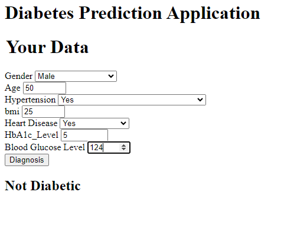
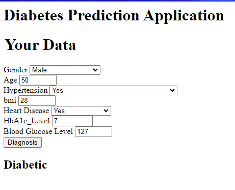

Diabetes Predction

This project aims to create a ML application which takes in info from a dataset about diabetes. Furthermore it also creates an app, which allows user inputs, and predicts whether someone may or may not be diabetic. 

Within this repository you will find all the requirements needed to run this application, as well as a pipeline to do so. Furthermore you will find a notebook which explores the detail of the dataset used as well as tests numerous types of Machine Learning algorithms.

 